# Ex-01_DS_Data_Cleansing
# AIM
To read the given data and perform data cleaning and save the cleaned data to a file.

# Explanation
Data cleaning is the process of preparing data for analysis by removing or modifying data that is incorrect ,incompleted , irrelevant , duplicated or improperly formatted. Data cleaning is not simply about erasing data ,but rather finding a way to maximize datasets accuracy without necessarily deleting the information.

# ALGORITHM:
## STEP 1:
Read the given Data

## STEP 2:
Get the information about the data

## STEP 3:
Remove the null values from the data

## STEP 4:
Save the Clean data to the file

# CODE:
```
Program developed by: KRISHNA PRAKAASH D M
Register number: 212221230052

import pandas as pd
import numpy as np
import seaborn as sns

df1 = pd.read_csv("Data_set.csv")
df1

df1.head()

df1.describe()

df1.info()

df1.tail()

df1.shape

df1.columns

df1.isnull().sum()

df1.duplicated()

#Using mode method to fill the data in columns as Object(String)
#mode()[0] - Takes the most reccuring value and fills the empty cells
df1['show_name'] = df1['show_name'].fillna(df1['show_name'].mode()[0])
df1['aired_on'] = df1['aired_on'].fillna(df1['aired_on'].mode()[0])
df1['original_network'] = df1['original_network'].fillna(df1['original_network'].mode()[0])

sns.boxplot(x="rating",data=df1)

#Using mean method to fill the data
df1['rating'] = df1['rating'].fillna(df1['rating'].mean())
df1['current_overall_rank'] = df1['current_overall_rank'].fillna(df1['current_overall_rank'].mean())
df1['watchers'] = df1['watchers'].fillna(df1['watchers'].mean())

#Checking the total no.of null values again
df1.isnull().sum()

#Checking info of the dataset to check all the columns have entries
df1.info()
```
# OUPUT:

## Dataset:
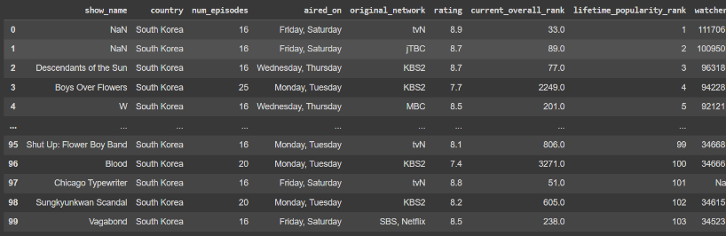

## Head:
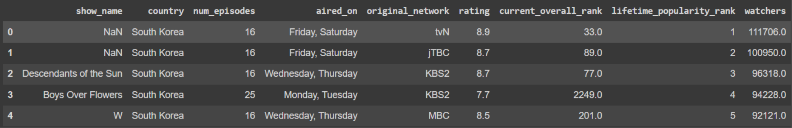

## Describe:
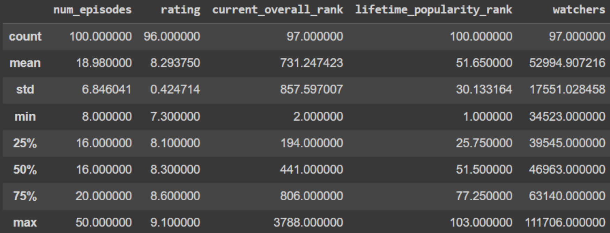

## Info:
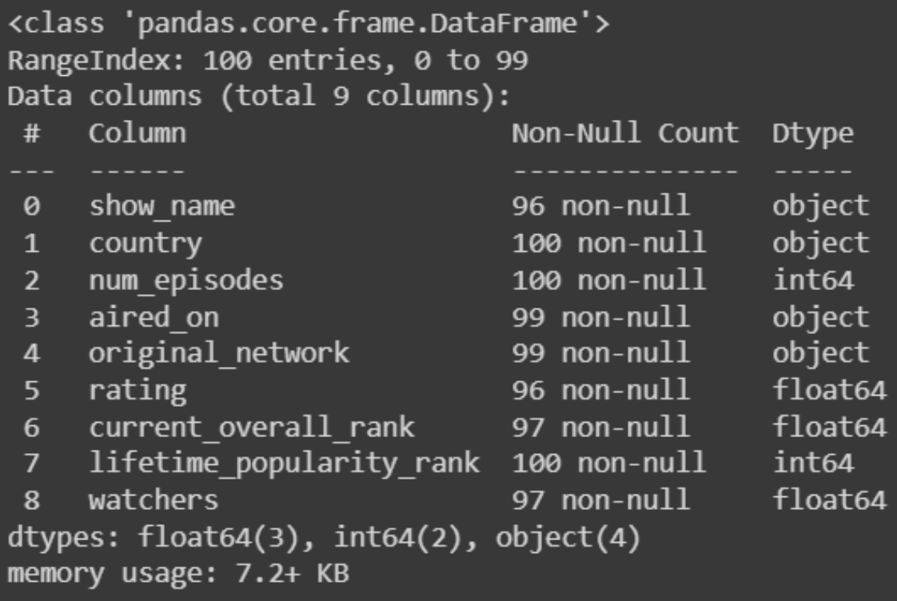

## Tail:
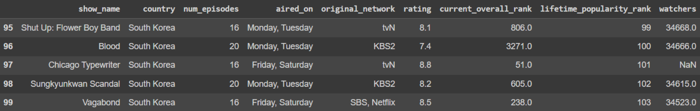

## Shape:
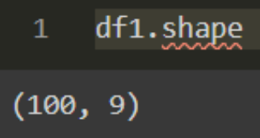

## isnull().sum() - Pre Cleaning:
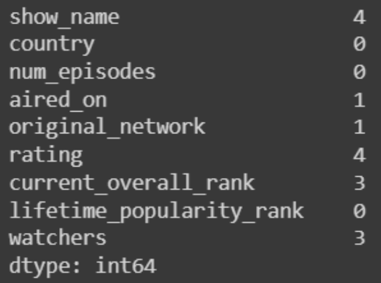

## Duplicates:
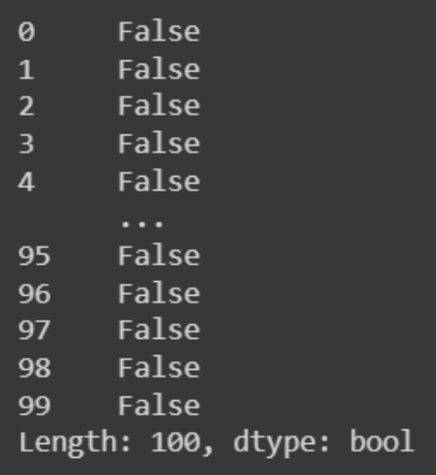

## SNS Plot - Rating:
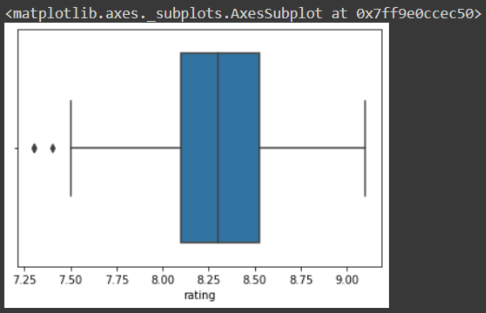

## isnull().sum() - Post Cleaning:
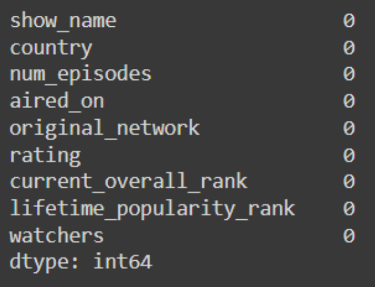

## Info - Post Cleaning:
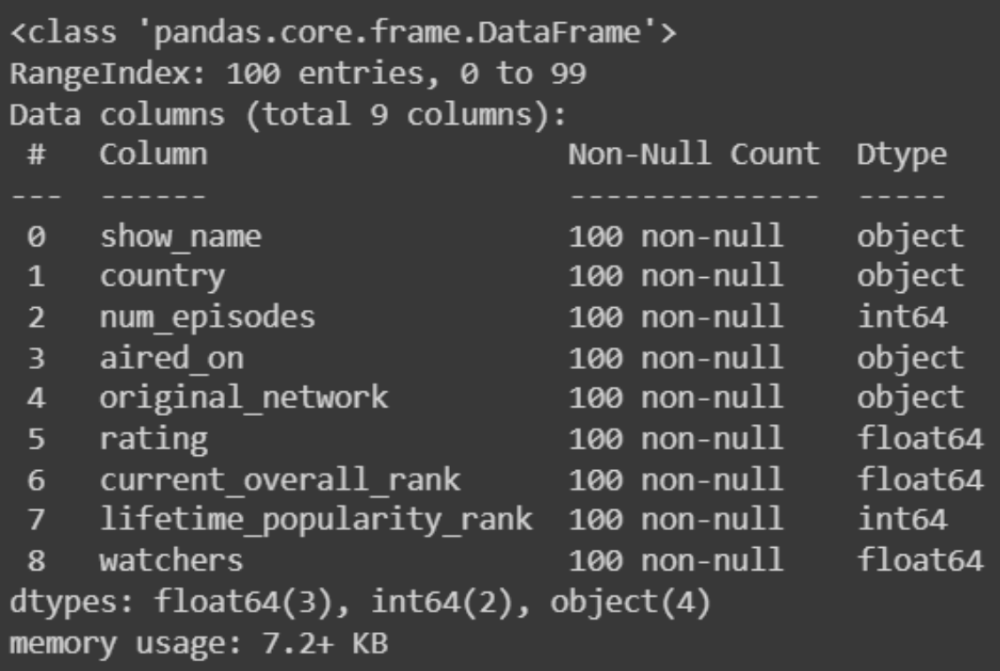

## Result:
The given data is read and data cleaning is performed and the cleaned data is saved to a file.
